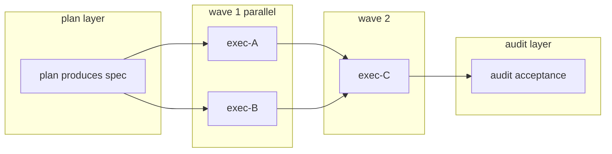

# dsh-punky-swarm — Multi-Agent Pipeline Governance for DeepSeek Harness

<p align="center">
  <a href="https://github.com/Punky971210/dsh-punky-swarm/blob/main/LICENSE"></a>
  <a href="https://awesome-dsh-plugin.com"></a>
  <a href="https://github.com/Punky971210/dsh-punky-swarm/actions/workflows/ci.yml"></a>
  <a href="https://github.com/Punky971210/dsh-punky-swarm/blob/main/packages/dsh-punky-swarm/package.json"></a>
  <a href="https://github.com/Punky971210/dsh-punky-swarm/tree/main/packages/dsh-punky-swarm/test"></a>
</p>

> *Engine-enforced guardrails for local agent pipelines: quality gates reject half-done work, checkpoints resume in place — keeps AI teams from breaking, not just running.*

中文: [README.md](README.md)

---

## Why

A single agent is easy to manage: when it drifts, you watch and pull it back. A batch of agents working together is another story — who runs first, who waits for whom, who writes which file, where to resume after a crash. With no one in charge, that is an incident site waiting to happen.

Three pain points everyone who has run long batches has hit:

- **Half-done work shipped as done** — downstream lanes get dispatched before upstream artifacts exist, and failures only surface at rework time;
- **One crash wipes out everything** — hours of batch work with no mid-way backup, reset to zero by a single crash;
- **Parallel lanes trample each other** — several agents writing the same repo overwrite each other, and nobody can tell who changed what.

The tools are not broken — what is missing are gates in the pipeline. This plugin installs three gates into the engine: artifacts incomplete, no dispatch; step done, save a checkpoint; one job, one writer at a time.

Every task is graded before it starts: a quick job you can finish directly (A), a self-contained chunk for one agent (B), and a job with many steps, roles and acceptance criteria goes through the full batch pipeline (C) — when in doubt, treat it as a big job, so small tasks never get a heavyweight process.

## Three Mechanisms, Three Cures

| Pain point | Mechanism | What you get |
|---|---|---|
| Half-done work shipped as done | **Engine-enforced gates**: upstream artifacts checked before dispatch, files checked on disk before settle, acceptance checked before complete — reject when anything is missing | Half-done work never reaches you |
| One crash wipes out everything | **Checkpointing**: every completed sub-step is preserved in git; resume from the breakpoint after a crash | Interruption is a pause at a save point, not a restart |
| Parallel lanes trample each other | **Single-writer lock + isolated workspaces**: one writer per lane at a time, each working in its own tree | Conflicts keep the scene for adjudication — never silently overwritten |

People work in three layers: Leader breaks down tasks and owns the final gate, Manager schedules, workers execute. Tasks run in dependency-ordered waves (wavePlan, below), and each batch goes through plan → exec → audit, artifacts connected by contract. Waves are fixed at batch creation and never recomputed — change the goal, create a new batch; a running batch does not drift. Lane state and events are fully traced and auditable.



**Since 0.4.1, governance ships with a ready config page and rule packs:**

- **Config page — no file editing**: the Web UI «Settings → Governance Config» page adjusts guardrail switches, rules and escalation windows; saving applies immediately (written to runtime.json and hot-reloaded), no restart needed;
- **Preset rule packs — one click, one guardrail suite**: sensitive-data protection (l1-sensitive), resource limits (l2-resource), and a combined pack (compose) work out of the box — no need to write rules from scratch;
- **No-progress probe for long runs**: a lane that keeps running but produces no checkpoint for too long is flagged as a candidate and reported to the Manager, so you see where it is stuck even without watching.

## Quick Start

Prerequisites: DeepSeek Harness (dsh) installed, Node.js ≥ 22.

```sh
# Install the npm package and load it into dsh (web is an example profile)
npm install -g dsh-punky-swarm
dsh plugin --profile web add dsh-punky-swarm
dsh web restart
```

Minimal run: ask the agent to create a three-layer batch with wave_plan (declare plan/exec/audit and artifact contracts) → the batch enters running → lanes dispatch in wave dependency order; watch state and gate gaps anytime with batch_status / gate_status.

## Docs & Demos

- Technical details (gate semantics, state machines, assembly & tool reference): [governance-technical.md](packages/dsh-punky-swarm/docs/governance-technical.md);
- Governance config page guide: [webui-governance-config.md](packages/dsh-punky-swarm/docs/webui-governance-config.md);
- Interactive demos (open in a browser): [waveplan-dag](assets/demo/waveplan-dag.html) · [tier3-gates](assets/demo/tier3-gates.html) · [checkpoint-resume](assets/demo/checkpoint-resume.html).

## Governance Tools

20 tools ship by default (optional ones such as `log_export` register when their capability key is enabled). The table walks through batching, state, gates, assets & locks, members, mailbox messaging, heartbeat watch, isolation and checkpoints:

| Tool | Governance capability / purpose | Stage |
|---|---|---|
| `wave_plan` | Create a batch layered into waves by dependency DAG; static contract checks; never recomputed | plan |
| `batch_phase` | Move a batch through planning→running→paused→aborted/complete | All |
| `batch_status` | Query batch state (phase/lanes/wavePlan/event digest) | All |
| `assign_check` | Grade task difficulty A/B/C and pick the executor (full scope, default C) | plan |
| `gate_status` | Query gate state (consume/produce/outputs missing lists) | plan/exec/audit |
| `artifact_types` | Query the artifact-type registry (layer/directory prefix conventions) | plan |
| `asset_claim` | Copy already-produced artifacts into batch assets | plan |
| `lane_claim` | O_EXCL single-writer lane lock (reject first; wait/force takeover) | exec |
| `lane_release` | Release a lane lock | exec |
| `member_status` | Operate member state (pending/running/review/idle) | exec |
| `member_settle` | Settle members (merged/failed/skipped/conflict, gate-checked) | exec/audit |
| `mailbox_send` | Send messages (inbox/outbox/broadcast; atomic write + ackId) | All |
| `mailbox_read` | Read unacknowledged messages | All |
| `mailbox_ack` | Acknowledge consumed messages | All |
| `lane_heartbeat` | Lane heartbeat query/trigger (flags stalled; flag only, no auto action) | exec |
| `lane_longrun` | No-progress probe for long runs (flags candidate, notifies the Manager) | exec |
| `lane_worktree_create` | Create an isolated git worktree per lane (baseline = integration HEAD) | exec |
| `lane_worktree_merge` | Merge a lane branch into the integration branch (conflicts keep the scene) | exec |
| `lane_checkpoint` | Git checkpoint after each sub-step (step N/total) | exec |
| `lane_checkpoint_status` | Query checkpoint history & progress (resume contract entry) | exec |

## Compatibility & Boundaries

Current version **0.4.1**; 816 tests passing (measured on Node 24, CI covers Node 22/24); peer dependencies @deepseek-ai/dsh-tools (^0.1.0-rc.6 \|\| ^0.1.1-rc.2) and @deepseek-ai/cordis (^4.0.1); listed on awesome-dsh-plugin.

Honest boundaries: in-process governance for a single machine — no distributed cluster sync, no cost control, no model-tier routing; zero cloud dependencies and no network exposure by default; failed lanes are terminal and rework means a new batch, never auto-resume.

## License

Licensed under **GNU AGPL v3 (AGPL-3.0-only)** as the sole license: you may freely use, modify and redistribute (including commercially) under [AGPL-3.0](LICENSE); if you provide the software as a network service after modification you must make the modified source available. Mirrors only copy release files and add commits — never rewriting .git history.
