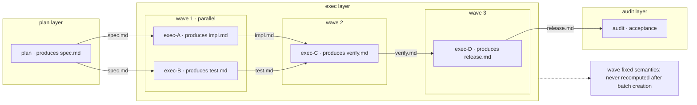
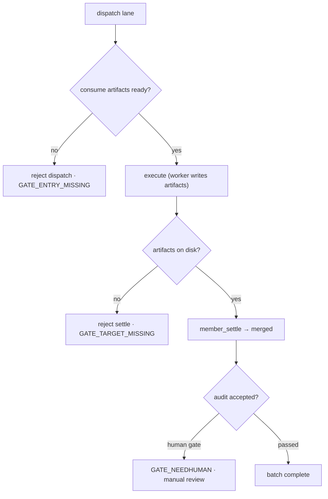
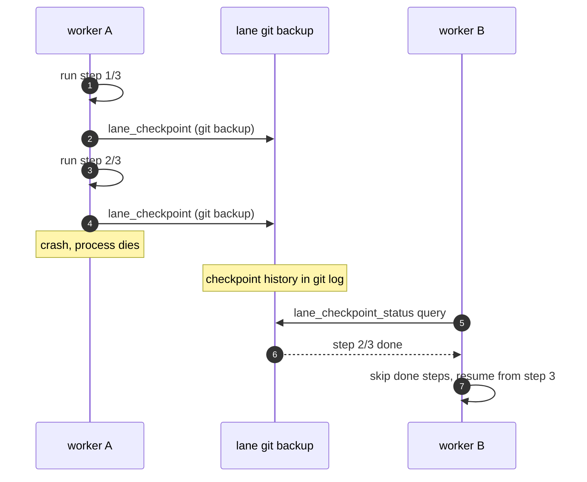

# dsh-punky-swarm — Multi-Agent Governance for DeepSeek Harness

<p align="center">
  <a href="https://github.com/Punky971210/dsh-punky-swarm/blob/main/LICENSE"></a>
  <a href="https://github.com/awesome-dsh-plugin/awesome-dsh-plugin"></a>
  <a href="https://github.com/Punky971210/dsh-punky-swarm/actions/workflows/ci.yml"></a>
  <a href="https://github.com/Punky971210/dsh-punky-swarm/blob/main/packages/dsh-punky-swarm/package.json"></a>
  <a href="https://github.com/Punky971210/dsh-punky-swarm/tree/main/packages/dsh-punky-swarm/test"></a>
</p>

> *Engine-enforced guardrails for DeepSeek Harness agent swarms: quality gates reject half-done work, crash-safe checkpoints resume in place — keeps AI teams from breaking, not just running.*

中文: [README.md](README.md)

## Contents

- [Abstract](#abstract) · [Why](#why) · [30-Second Overview](#30-second-overview) · [Quick Start](#quick-start) · [Capabilities](#capabilities-10) · [Architecture](#architecture) · [Demo](#demo) · [Compatibility Matrix](#compatibility-matrix) · [Roadmap](#roadmap) · [License](#license)

---

## Abstract

dsh-punky-swarm is a single-machine multi-agent governance plugin for DeepSeek Harness. Tasks run in dependency-ordered waves, engine-enforced gates reject half-done work, and checkpoints let long-running batches resume after a crash. The plugin ships 19 governance tools (20 with all capabilities enabled), passes 582 tests, and is licensed under AGPL-3.0-only.

## Why

Single agents are easy; swarms are hard. Parallel multi-agent execution is not just firing prompts together — who runs first, who waits for whom, who writes which file, where to resume after a crash. Those are the real questions of swarm governance.

- **Ungated dispatch starts work half-baked** — downstream lanes get dispatched before their dependency artifacts exist, and failures surface only at rework time. Tier3 gates check consume artifacts before dispatch and reject with GATE_ENTRY_MISSING, stopping half-baked work at the source.
- **Long tasks without checkpoints lose everything on a crash** — one crash resets hours of batch work. Checkpoints git-preserve progress per sub-step (step N/total); a new worker queries checkpoints and skips completed steps.
- **Parallel lanes writing one repo trample each other** — concurrent commits overwrite each other and conflicts are untraceable. Lane worktrees isolate each lane physically, merges serialize, and conflicts keep the scene for adjudication.

## 30-Second Overview

Three pain points:

- **Ungated dispatch starts work half-baked** — downstream dispatched before upstream artifacts are ready; failure only surfaces at rework;
- **No checkpoints, long tasks lose everything on a crash** — hours of batch work reset by a single crash;
- **Parallel lanes writing one repo trample each other** — concurrent commits overwrite, and nobody can tell who changed what.

**Fig 1 · wavePlan dependency DAG** — plan/exec/audit swim lanes; wave 1-3 inside exec: parallel within a wave, serial between waves; edges carry artifact names.



## Quick Start

Requirements: DeepSeek Harness (dsh) installed.

```sh
npm install -g dsh-punky-swarm
dsh plugin --profile web add dsh-punky-swarm
dsh web restart
```

Minimal example (from install to the first three-layer batch):

```text
1. Install the plugin and restart dsh as above.
2. In a session, ask the agent to create a batch via wave_plan (declaring
   plan/exec/audit layers and artifact contracts) → batch enters running →
   lanes dispatch in wave dependency order.
3. Inspect batch state and gate gaps with batch_status / gate_status.
```

## Capabilities (10)

1. **ABC task-difficulty routing gate** — A=Leader direct / B=single subagent / C=wave_plan batch; scope=full, default to C.
2. **wavePlan with fixed semantics** — 3 layers (plan→exec→audit), waves layered by dependency DAG, never recomputed after batch creation.
3. **Tier3 engine-enforced gates** — dispatch requires consume artifacts (GATE_ENTRY_MISSING otherwise); settle requires artifacts on disk; complete requires audit acceptance.
4. **Checkpoint resume** — git-preserved progress per sub-step (step N/total); a new worker queries checkpoints and skips completed steps after a crash.
5. **Lane worktree isolation + serialized merge** — parallel lanes writing one git repo stay conflict-free; merges serialize; conflicts keep the scene.
6. **Mailbox blackboard** — inbox/outbox/broadcast, atomic writes with ackId, metadata only.
7. **lane_claim single-writer lock** — O_EXCL, conflict rejects first, wait or force takeover.
8. **Member state machine** — pending→running→review→merged/failed/conflict/skipped; terminal states reject further writes.
9. **Batch session isolation** — state files are the single source of truth; event stream is auditable.
10. **Project state** — 19 governance tools by default (20 with all capabilities), 582/582 tests passing, v0.3.6 released, AGPL-3.0-only, listed on awesome-dsh-plugin.

## Architecture

- **Role layering** — Leader (decisions & final gate) → Manager (scheduling) → Worker (execution); batches are organized into plan/exec/audit layers whose artifacts connect by contract.
- **State & communication** — batch/member state lives in state files as the single source of truth; cross-context communication goes through the mailbox blackboard (inbox/outbox/broadcast); every operation writes to the event stream — auditable and traceable.
- Governance is not a documented convention but engine-enforced gates — state files are the single source of truth and every step leaves an event trail.

## Demo

**Fig 2 · Tier3 engine-enforced gates** — consume artifacts checked before dispatch (missing → GATE_ENTRY_MISSING, dispatch rejected), artifacts checked on disk before settle (missing → GATE_TARGET_MISSING, settle rejected), human adjudication when needed (GATE_NEEDHUMAN).



**Fig 3 · checkpoint crash recovery** — every completed sub-step is git-preserved via lane_checkpoint (step N/total); after a crash a new worker queries progress with lane_checkpoint_status and resumes from the first unfinished step.



## Compatibility Matrix

| Component | Version | Status |
|---|---|---|
| dsh-punky-swarm | 0.3.6 (current release) | Supported |
| Node.js | >=22 (package.json engines) | Supported (tested on Node 24) |
| @deepseek-ai/dsh-tools (peer) | ^0.1.0-rc.6 \|\| ^0.1.1-rc.2 | Supported |
| @deepseek-ai/cordis (peer) | ^4.0.1 | Supported |
| Other dsh / Node versions | — | Not verified |

> The repo CI and test matrix are authoritative; unverified entries are marked as-is, with no version claims beyond what has actually been tested.

## Roadmap

- gh-pages hosting for demo animations (animation HTML already in assets/demo/, open directly in a browser)

## License

Licensed under **GNU AGPL v3 (AGPL-3.0-only)** as the sole license:

- You may freely use, modify, and redistribute (including commercially) under [AGPL-3.0](LICENSE); if you provide the software as a network service after modification, you must make the modified source available under AGPL-3.0.
- Mirror sync transparency: any mirror only copies release files (byte-for-byte) and adds commits — never rewriting .git history.
