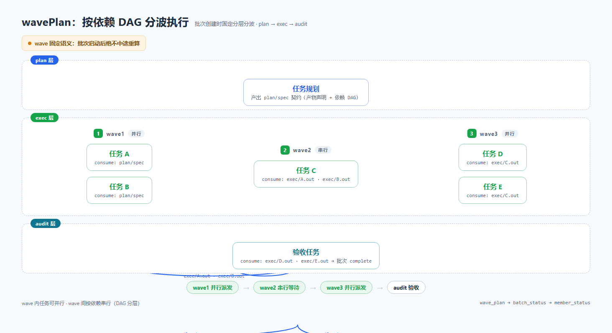
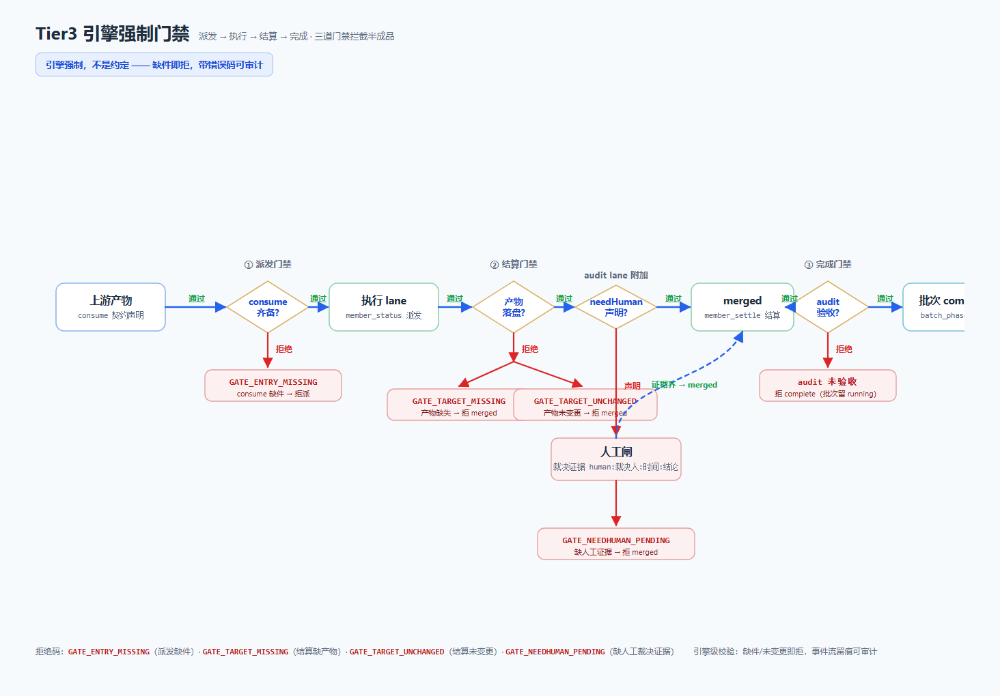
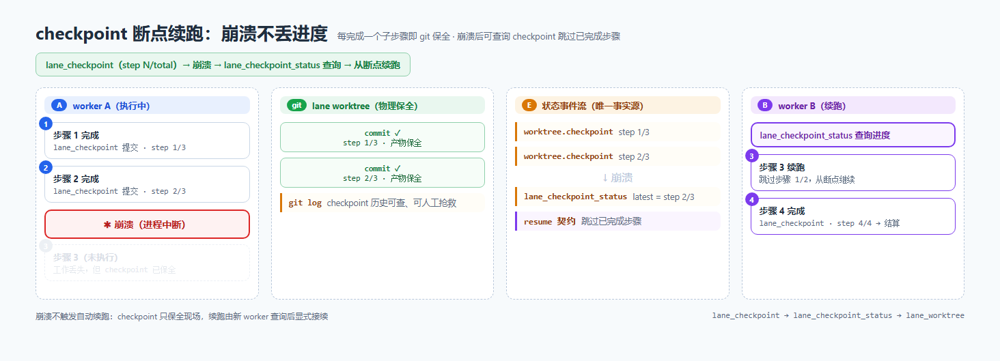
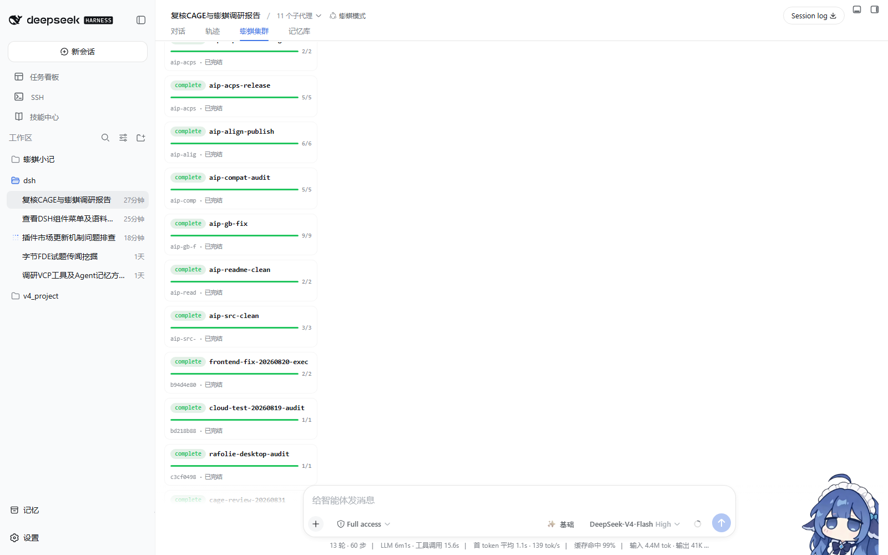

# dsh-punky-swarm —— DeepSeek Harness 多 Agent 集群治理插件

<p align="center">
  <a href="https://github.com/Punky971210/dsh-punky-swarm/blob/main/LICENSE"></a>
  <a href="https://github.com/awesome-dsh-plugin/awesome-dsh-plugin"></a>
  <a href="https://github.com/Punky971210/dsh-punky-swarm/actions/workflows/ci.yml"></a>
  <a href="https://github.com/Punky971210/dsh-punky-swarm/blob/main/packages/dsh-punky-swarm/package.json"></a>
  <a href="https://github.com/Punky971210/dsh-punky-swarm/tree/main/packages/dsh-punky-swarm/test"></a>
</p>

> **单机 dsh 的多 Agent 集群编排器——门禁拒绝半成品，检查点断点续跑，让 AI 团队不「坏」而不只是能「跑」。**
>
> *Engine-enforced guardrails for DeepSeek Harness agent swarms: quality gates reject half-done work, crash-safe checkpoints resume in place — keeps AI teams from breaking, not just running.*

English: [README.en.md](README.en.md)

## 快速了解（30 秒）

三个痛点：

- **无门禁的派发会带病开工**——上游产物没齐就派下游，失败要到返工才发现；
- **无检查点的长任务一崩全丢**——几小时的批次因一次崩溃回到原点；
- **多 lane 同写一个仓库互相踩**——并发提交互相覆盖，出冲突说不清谁改了什么。



## 快速开始（Quick Start）

环境要求：已安装 DeepSeek Harness（dsh）。

```sh
# 一条命令安装 npm 包
npm install -g dsh-punky-swarm
# 装入 dsh（web 为示例 profile，可替换）
dsh plugin --profile web add dsh-punky-swarm
dsh web restart
```

最小示例（从安装到跑通第一个三层批次）：

```text
1. 按上一步安装插件并重启 dsh。
2. 在会话中让 Agent 执行：wave_plan 建批（声明 plan/exec/audit 三层与产物契约）
   → 批次进入 running → 各 lane 按 wave 依赖顺序派发执行。
3. 用 batch_status / gate_status 观察批次状态与门禁缺件清单。
```

## 能力清单（10 项）

1. **任务难度 ABC 路由门禁**：A=Leader 直做 / B=单 subagent / C=wave_plan 建批；评估对象为完整目标任务（scope=full），default to C。
2. **wavePlan 固定语义分波**：plan→exec→audit 三层，wave 按依赖 DAG 分层，批次创建后绝不中途重算。
3. **Tier3 引擎强制门禁**：consume 产物齐备才派发（缺则 GATE_ENTRY_MISSING 拒派）；产物落盘才结算（缺则拒 merged）；audit 验收完成才 complete。
4. **checkpoint 断点续跑**：每完成一个子步骤即 git 保全（step N/total），崩溃后新 worker 查询 checkpoint 跳过已完成步骤。
5. **lane worktree 物理隔离 + 串行 merge**：多 lane 同写一个 git 仓库互不冲突，合并串行化，冲突保留现场。
6. **mailbox 黑板通信**：inbox/outbox/broadcast 三向，原子写 + ackId，只写元数据不复制正文。
7. **lane_claim 单写者锁**：O_EXCL 锁，冲突先拒绝，可 wait 等待、可 force 接管。
8. **成员状态机**：pending→running→review→merged/failed/conflict/skipped，终态后拒绝再写。
9. **批次会话隔离**：状态文件为唯一事实源，事件流留痕可审计。
10. **工程状态**：19 个治理工具（默认装配，开启全部能力为 20 个）、582/582 测试全绿、v0.3.6 已发布（AGPL-3.0-only）、已收录 awesome-dsh-plugin。

## 演示（Demo）

- 静态图：
  - 
  - 
  - 图4 · 面板真实截图（dsh web「Punky Swarm 集群」监控面板）：
    - 
    - 
    - 
- 动画演示（HTML 单文件，浏览器打开即播放；gh-pages 托管待上线，见[路线图](#路线图roadmap)）：
  - [wavePlan 分波 DAG 动画](./assets/demo/waveplan-dag.html)
  - [Tier3 引擎门禁动画](./assets/demo/tier3-gates.html)
  - [checkpoint 断点续跑动画](./assets/demo/checkpoint-resume.html)

## 文档导航（Contents）

- [摘要](#摘要abstract) · [为什么需要它](#为什么需要它why) · [架构](#架构architecture) · [兼容矩阵](#兼容矩阵compatibility-matrix) · [路线图](#路线图roadmap) · [License](#license)
- 英文摘要与能力清单：[README.en.md](README.en.md)

---

## 摘要（Abstract）

dsh-punky-swarm 是 DeepSeek Harness（dsh）的多 Agent 集群治理插件：任务按依赖分波执行，引擎级门禁拦截半成品，检查点让长任务崩溃可续跑。它面向单机场景，在同一 dsh 进程内治理一批 worker（批次 / 门禁 / 通信 / 恢复），提供单写者锁、mailbox 黑板通信与事件审计。当前状态：npm 包 `dsh-punky-swarm@0.3.6` 一条命令装入 dsh；默认装配 19 个治理工具；582 项测试全绿；以 AGPL-3.0-only 单一许可发布。

*dsh-punky-swarm is a single-machine multi-agent governance plugin for DeepSeek Harness. Tasks run in dependency-ordered waves, engine-enforced gates reject half-done work, and checkpoints let long-running batches resume after a crash. The plugin ships 19 governance tools (20 with all capabilities enabled), passes 582 tests, and is licensed under AGPL-3.0-only.*

## 为什么需要它（Why）

单 Agent 好写，多 Agent 集群难管：并行任务的依赖怎么排、产物怎么对齐、失败怎么恢复、谁改了什么。多 Agent 并行不是把 prompt 一起发出去就完了——谁先跑、谁等谁、谁写哪个文件、崩了从哪续，这些才是集群治理的问题。

- **无门禁的派发会带病开工**：下游在依赖产物缺失时就被派发，错误传播到返工阶段才暴露。Tier3 门禁在派发前核对 consume 产物，缺件即拒派（GATE_ENTRY_MISSING），把「带病开工」挡在源头。
- **无检查点的长任务一崩全丢**：长批次没有中间保全，一次崩溃让数小时工作归零。checkpoint 在每完成一个子步骤时做 git 保全并记录进度（step N/total），崩溃后新 worker 可查询 checkpoint 跳过已完成步骤。
- **多 lane 同写一个仓库互相踩**：并发写同一 git 仓库会互相覆盖、冲突难追责。lane worktree 为每个 lane 建立物理隔离的工作树，merge 串行执行，冲突保留现场由裁决方处置。

## 架构（Architecture）

- **角色分层**：Leader（决策与终门禁）→ Manager（调度）→ Worker（执行）；批次按 plan/exec/audit 三层组织，各层产物按契约衔接。
- **状态与通信**：批次/成员状态以状态文件为唯一事实源；跨上下文通信走 mailbox 黑板（inbox/outbox/broadcast）；每一步操作写入事件流，可审计可回溯。
- 治理不是写在文档里的约定，而是引擎强制执行的门禁——状态文件是唯一事实源，每一步都有事件可查。

## 兼容矩阵（Compatibility Matrix）

| 组件 | 版本 | 状态 |
|---|---|---|
| dsh-punky-swarm | 0.3.6（当前发布版） | 支持 |
| Node.js | >=22（package.json engines） | 支持（实测于 Node 24） |
| @deepseek-ai/dsh-tools（peer） | ^0.1.0-rc.6 \|\| ^0.1.1-rc.2 | 支持 |
| @deepseek-ai/cordis（peer） | ^4.0.1 | 支持 |
| 其他 dsh / Node 版本 | — | 未验证 |

> 以仓库 CI 与测试矩阵为准；未验证项如实标注，不作未经实测的版本声明。

## 路线图（Roadmap）

- 演示动画 gh-pages 托管上线（动画 HTML 已在 assets/demo/，可直接浏览器打开）
- README 英文全文翻译（可选）

## License

本项目以 **GNU AGPL v3（AGPL-3.0-only）为唯一许可**：

- 在遵守 [AGPL-3.0](LICENSE) 的前提下，可自由使用、修改、分发（含商用）；若修改后通过网络提供服务，须按 AGPL-3.0 公开修改内容。
- 镜像同步透明说明：任何镜像仅复制发布文件（逐字节一致）并新增 commit 推送，不改写 .git 历史。
