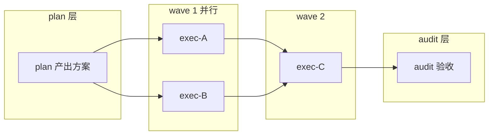

# dsh-punky-swarm —— 多 Agent 集群治理插件（DeepSeek Harness）

<p align="center">
  <a href="https://github.com/Punky971210/dsh-punky-swarm/blob/main/LICENSE"></a>
  <a href="https://awesome-dsh-plugin.com"></a>
  <a href="https://github.com/Punky971210/dsh-punky-swarm/actions/workflows/ci.yml"></a>
  <a href="https://github.com/Punky971210/dsh-punky-swarm/blob/main/packages/dsh-punky-swarm/package.json"></a>
  <a href="https://github.com/Punky971210/dsh-punky-swarm/tree/main/packages/dsh-punky-swarm/test"></a>
</p>

> **本地多 Agent 流水线治理——门禁拦下半成品，检查点原地续跑，让 AI 团队不「坏」而不只是能「跑」。**
>
> *Engine-enforced guardrails for local agent pipelines: quality gates reject half-done work, checkpoints resume in place — keeps AI teams from breaking, not just running.*

English: [README.en.md](README.en.md)

---

## 为什么需要它

一个 Agent 好管：跑偏了，你盯一眼就能拽回来。一批 Agent 一起干活是另一回事——谁先跑、谁等谁、谁写哪个文件、崩了从哪续，这些没人管，跑起来就是事故现场。

三个痛点，都是跑过长任务的人撞见过的：

- **半成品当完成品交**：下游在上游产物没齐时就被派活，错误一路传到返工才暴露；
- **一崩全丢**：跑了几小时的批次没有中间存档，一次崩溃全部归零；
- **并发互相踩**：几个 Agent 同时写同一个仓库，互相覆盖，出冲突说不清谁改了什么。

工具本身没坏——缺的是流程上的闸口。本插件把三道闸口装进引擎：产物不齐，不放行；干一步，存一档；同一份活，只许一个人写。

任务开工前先分个级：顺手的小活直接干（A），要独立跑一摊的交一个 Agent（B），环节多、要协作、要验收的走整条批次流水线（C）——拿不准的按大活处理，不把小任务做成大流程。

## 三个机制，正好治三件事

| 痛点 | 机制 | 你得到 |
|---|---|---|
| 半成品当完成品交 | **门禁引擎强制**：派发前查上游产物、结算前查落盘、完结前查验收，缺件直接拒 | 半成品到不了你手里 |
| 一崩全丢 | **checkpoint 存档**：每完成一个子步骤 git 保全一次，崩了从断点续 | 中断只是停在存档点，不是从头再来 |
| 并发互相踩 | **单写者锁 + 隔离工作区**：同一 lane 同时只许一个写者，各改各的树 | 冲突保留现场，交人裁决，不静默覆盖 |

干活的人分三层：Leader 拆解与终审、Manager 调度、worker 执行；任务按依赖排成波次执行（wavePlan，见下），批内再分 plan / exec / audit 三阶段，每阶段产物按契约衔接。批次建好后分层不再中途重算——想改目标就新建批次，正在跑的不会偷跑偏；每个 lane 的状态与事件全程留痕，可审计可回溯。



**0.4.1 起，治理也配好了顺手的面板与规则包：**

- **配置页面，不用改文件**：Web UI「设置 → 治理配置」页调整护栏开关、规则与升级窗口，保存即时生效（写入 runtime.json 热加载），全程免重启；
- **预设规则包，一句启用一套护栏**：敏感数据防护（l1-sensitive）、资源上限（l2-resource）、组合包（compose）开箱即用，不必从零写规则；
- **长跑无进展探针**：一直跑但迟迟不产出 checkpoint 的 lane 会被标为候选并通知 Manager，没人盯梢也看得见卡在哪。

## 快速开始

前置：已安装 DeepSeek Harness（dsh），Node.js ≥ 22。

```sh
# 安装 npm 包并装入 dsh（web 为示例 profile，可替换）
npm install -g dsh-punky-swarm
dsh plugin --profile web add dsh-punky-swarm
dsh web restart
```

最小跑通：让 Agent 用 wave_plan 建一个三层批次（声明 plan/exec/audit 与产物契约）→ 批次进入 running → lane 按波次依赖自动派发；用 batch_status / gate_status 随时看状态与门禁缺件。

## 文档与演示

- 技术细节（门禁语义、状态机、装配与工具参考）：[governance-technical.md](packages/dsh-punky-swarm/docs/governance-technical.md)；
- 治理配置页说明：[webui-governance-config.md](packages/dsh-punky-swarm/docs/webui-governance-config.md)；
- 交互演示（浏览器直接打开）：[waveplan-dag](assets/demo/waveplan-dag.html) · [tier3-gates](assets/demo/tier3-gates.html) · [checkpoint-resume](assets/demo/checkpoint-resume.html)。

## 治理工具一览

治理动作由 20 个默认装配的工具承载（`log_export` 等可选工具在对应能力键开启后另计），下表按建批、状态、门禁、资产与锁、成员、mailbox 通信、心跳看护、隔离与断点分组：

| 工具 | 治理能力 / 用途 | 阶段 |
|---|---|---|
| `wave_plan` | 按依赖 DAG 分波建批，三层产物契约静态校验，分层固定不重算 | plan |
| `batch_phase` | 批次阶段迁移（planning→running→paused→aborted/complete） | 全程 |
| `batch_status` | 批次状态查询（phase/lanes/wavePlan/事件摘要） | 全程 |
| `assign_check` | 任务难度 A/B/C 判定与执行主体（评估完整目标，拿不准按 C） | plan |
| `gate_status` | 门禁状态查询（consume/produce/outputs 缺件清单） | plan/exec/audit |
| `artifact_types` | 产物类型注册表查询（层/目录前缀约定） | plan |
| `asset_claim` | 已直做产物复制归位为批次资产 | plan |
| `lane_claim` | O_EXCL 单写者锁认领（冲突先拒，可 wait/force 接管） | exec |
| `lane_release` | 释放 lane 锁 | exec |
| `member_status` | 成员状态操作（pending/running/review/idle） | exec |
| `member_settle` | 成员结算（merged/failed/skipped/conflict，带门禁校验） | exec/audit |
| `mailbox_send` | 发送消息（inbox/outbox/broadcast，原子写 + ackId） | 全程 |
| `mailbox_read` | 读取未确认消息 | 全程 |
| `mailbox_ack` | 确认消费消息 | 全程 |
| `lane_heartbeat` | lane 心跳查询/触发（失活标 stalled，只标记不自动处置） | exec |
| `lane_longrun` | 长跑无进展探针（标候选并通知 Manager） | exec |
| `lane_worktree_create` | 为 lane 建隔离 git worktree（从集成分支 HEAD 基线） | exec |
| `lane_worktree_merge` | lane 分支并入集成分支（冲突保留现场交裁决） | exec |
| `lane_checkpoint` | 每完成子步骤即 git 保全（step N/total） | exec |
| `lane_checkpoint_status` | 查询 checkpoint 历史与进度（续跑契约入口） | exec |

## 兼容性与边界

当前版本 **0.4.1**；816 项测试全绿（实测于 Node 24，CI 覆盖 Node 22/24）；peer 依赖 @deepseek-ai/dsh-tools（^0.1.0-rc.6 \|\| ^0.1.1-rc.2）与 @deepseek-ai/cordis（^4.0.1）；已收录 awesome-dsh-plugin。

诚实边界：面向单机进程内治理——不做分布式集群同步、无成本控制、无模型分层路由，零云依赖、默认零网络暴露；失败 lane 为终态，重做即新建批次，不自动续跑。

## License

**GNU AGPL v3（AGPL-3.0-only）** 为唯一许可：遵守 [AGPL-3.0](LICENSE) 可自由使用、修改、分发（含商用）；修改后经网络提供服务须公开修改内容。镜像仅复制发布文件并追加 commit，不改写 .git 历史。
