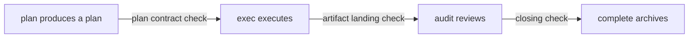

# dsh-punky-swarm — Punky Swarm Cluster Governance

  

> **Positioning**: a cluster-governance plugin for dsh (DeepSeek Harness) — it orchestrates a cohort of Agent subprocesses **locally** into gated, auditable, recoverable batch pipelines. **Zero cloud dependency, zero network exposure by default**; orchestration, adjudication, and audit trails all happen inside the dsh process.

中文: [README.md](README.md)

## Features

- **Two-layer governance, two lines of defense** — batch-level orchestration and call-level guardrails apply in layers: the batch layer decides "how tasks are dispatched", the guardrails decide "whether each tool call is out of bounds", and neither can be bypassed.
- **Automatic three-layer gates** — batches advance through plan → exec → audit; entry, plan contract, artifacts, and closing are validated layer by layer (Entry / Plan / Exit / Complete). Missing pieces are intercepted on the spot, so problems never flow into batch results.
- **Difficulty-graded task routing** — tasks are graded first (A direct / B single worker / C batch), and complex tasks automatically enter the batch pipeline; a C grading without a batch created blocks execution.
- **Concurrency-safe multi-lane parallelism** — per-lane single-writer locks plus git worktree physical isolation let multiple lanes write the same repository in parallel without overwriting each other; conflicts keep the scene intact and are handled after adjudication.
- **In-process messaging with loop protection** — the mailbox's three boxes (inbox / outbox / broadcast) use atomic writes and acknowledgements; loop protection suppresses message storms, and communication paths stay traceable.
- **Crash-recoverable** — heartbeat expiry detection plus progress checkpoint preservation: after a crash the scene and artifacts remain inspectable and a new worker can take over; no automatic resume — a failed task is redone by opening a new batch.
- **Read-only monitoring panel** — the Web UI shows batches, lane states, and the event timeline directly; read-only, non-intrusive, so nothing can be altered by accident.
- **Call-level guardrails (6 primitives)** — six adjudication primitives: ALLOW / DENY / REQUIRE_APPROVAL / NARROW / DEFER / PAUSE. Zero interception out of the box; rules are configured on demand, and an out-of-bounds hit produces a **tamper-evident refusal receipt** (sha256 hash-chain anchored; re-checking can locate where tampering happened). Adjudication is deterministic, predictable, and easy to test.
- **Hot-updatable configuration, no restart** — guardrail rules and switches written to `runtime.json` take effect immediately, with no process restart.
- **National-standard AIP compatible** — follows the descriptor structures of GB/Z 185-2026 (Artificial Intelligence — Agent Interconnection): tool 6 attributes / agent ACS / message-task-session mapping; additive only, pluggable.
- **Optional ACPs communication** — external mTLS service endpoint, registry registration, and external discovery, all off by default (secure default).
- **Runs locally, works out of the box** — zero cloud dependency, zero network exposure by default; a single npm package contains the plugin engine, the Punky Swarm preset, and the jiufeng-team role guide, with bilingual (Chinese / English) documentation.

## Installation

Prerequisites: Node.js ≥ 22 and a dsh runtime; `web` in the commands below is an example profile — replace it with the profile you actually use.

### Quick route (npm)

```sh
npm install -g dsh-punky-swarm
dsh plugin --profile web add dsh-punky-swarm
dsh web restart
```

### Development route (git source)

```sh
git clone https://github.com/Punky971210/dsh-punky-swarm.git
cd dsh-punky-swarm
npm ci --prefix packages/dsh-punky-swarm
# POSIX
dsh plugin --profile web add link:$(pwd)/packages/dsh-punky-swarm
# Windows PowerShell
dsh plugin --profile web add link:$PWD\packages\dsh-punky-swarm
dsh web restart
```

`web` is an example profile — replace it with the profile you actually use. On startup the plugin automatically syncs its built-in preset and skill guide to the user directory (`~/.dsh/.agent-presets/jiufeng`, `~/.agents/skills/jiufeng-team`) — no manual placement needed; identical content is skipped, otherwise it is updated to the packaged version.

## Quick Start

Once the plugin is installed, three steps get your first batch running:

1. **Enable the plugin**: run the install commands above; after `dsh web restart`, the plugin and the monitoring panel are loaded.
2. **Create your first batch**: describe the goal to the Leader; once the Leader finishes the difficulty grading, `wave_plan` creates the batch and tasks are layered into waves automatically by dependency. A minimal task-intent example:
   > Split into a three-layer batch: the plan layer produces the implementation plan; the exec layer implements per the plan and adds tests, depending on the plan artifacts; the audit layer verifies and then releases.
3. **Watch the progress**: open the monitoring panel (the "Punky Swarm cluster" tab on the session page) to view batch phases, lane states, and the event timeline; when a batch completes, its artifacts are archived automatically and everything stays inspectable.

Tasks first go through difficulty routing (A direct / B single worker / C batch), so complex tasks automatically enter a batch and small tasks do not get a heavyweight process. Tool and batch-contract details: see [docs/governance-technical.en.md](docs/governance-technical.en.md).

## Monitoring Panel

The plugin ships a **read-only** monitoring panel — the third tab, "Conversation / Trajectory / Punky Swarm cluster", at the top of the session area. Available on install, no extra configuration:

- **Batch list**: phase and completion progress, with auto-release / completed markers;
- **Stats bar**: total batches / running / completed / abnormal (failed + conflict);
- **Batch detail**: lane status cards (state, task summary, gate missing items, layer and dependencies), event timeline, inbox counts;
- **Read-only by design**: 3-second auto-refresh, follows the light/dark theme; batch and gate states are view-only, and governance operations are carried out by the Leader through governance tools.

## Configuration at a Glance

Plugin configuration is centralized in `cordis.patch.yml`; the key assembly keys and their defaults:

| Capability | Assembly key | Default |
|---|---|---|
| Governance tools and watch capabilities (aip / discovery / verify / watch / worktree / budget / trajectory) | `capabilities.*` | On |
| Log export (`log_export`), conflict-resolution agent | `capabilities.logs` / `capabilities.worktree.mergeAgent` | Off |
| Call-level guardrails | `governance.hook` | On; factory `rules` empty (zero interception) |
| National-standard AIP catalog and query endpoint | `aip.enabled` | On |
| Identity system (AIC / CAI / signing) | `aip.identity.enabled` | Off |
| ACPs communication (mTLS endpoint / bridge / registry / discovery) | `acps.*` | Off (when off: no listeners, no timers, no network) |

Key semantics, configuration examples, and rule authoring: see [docs/governance-technical.en.md](docs/governance-technical.en.md) and [docs/guardrails-hook.en.md](docs/guardrails-hook.en.md).

### Secure defaults

- **Zero interception out of the box**: guardrail `rules` are empty by default — install and use, existing behavior unchanged; enable rules on demand.
- **Network capabilities off by default**: network-class capabilities such as ACPs are off by default; when off there are no listeners, no timers, and no network path.
- **Ready to run locally**: no distributed infrastructure, no external services; a local dsh instance already provides the full governance capability.

## Core Concepts

- **Batch and lane**: `wave_plan` layers the target task into waves by dependency (DAG); each minimal unit of work is a lane. The layering is fixed at creation time and never recomputed afterward, so the flow stays predictable.
- **Three-layer structure**: tasks in a batch are divided into plan (produce a plan) → exec (execute) → audit (review); artifacts are validated at each layer and missing pieces are not released; tasks that fail review are not merged into batch results.
- **Two-layer governance**: batch-level orchestration governs "how tasks are dispatched", and call-level guardrails govern "whether each tool call is out of bounds" — the two layers stack and take effect in series; the guardrails can only tighten, never be bypassed.
- **Traceable state**: batches (planning → running → paused → aborted / complete) and lanes (pending → running → review → merged / failed / skipped / conflict) are driven by a state machine; events leave a complete trace and are auditable, so recovery and re-checks are grounded in records.

A typical batch pipeline:



**Origins**: a single-agent end-to-end flow needs heavy human involvement, while hard-coding the flow into a graph makes changes costly and leaves little freedom for agents; this plugin takes the middle path — Leader decomposition, multi-role collaboration, gate adjudication — balancing process control with agent freedom.

**Boundary (not provided)**: this plugin targets single-machine, in-process governance; it does not provide cross-machine distributed cluster sync, multi-machine orchestration, cost control, or model-tiered routing. Crash recovery is checkpoint preservation plus human-inspectable handover — no automatic resume.

Mechanism details, the state machine, and the tool reference: see [docs/governance-technical.en.md](docs/governance-technical.en.md).

## Documentation

Technical details live under `docs/` (each document ships with an English version):

| Document | Contents |
|---|---|
| [docs/governance-technical.en.md](docs/governance-technical.en.md) | Batch-level governance technical manual: three-layer gates, state machine, wavePlan contract, 20 governance tools reference, assembly key table, lifecycle |
| [docs/guardrails-hook.en.md](docs/guardrails-hook.en.md) | Call-level guardrail technical manual: runtime semantics of the 6 primitives, rule configuration and examples, refusal receipts and verification, hot update, boundaries and not-provided items |
| [docs/aip-compliance.en.md](docs/aip-compliance.en.md) | National-standard AIP compliance details: tool 6 attributes, ACS field set, message / task / session mapping, identity system |
| [docs/acps-communication.en.md](docs/acps-communication.en.md) | ACPs communication details: mTLS endpoints, internal bridge, registry / discovery, configuration examples, capability boundaries |
| [docs/governance-boundaries.en.md](docs/governance-boundaries.en.md) | Capability boundary statements: hash-chain and canonical boundaries, rule-example and test sync maintenance conventions |

## License and Commercial Licensing

This project is licensed under **GNU AGPL v3 (AGPL-3.0) as its sole license**:

- Under [AGPL-3.0](LICENSE), free to use, modify, and distribute (including commercially); if you provide the modified software as a network service, you must publish your modifications under AGPL-3.0.
- For other licensing (e.g., closed-source commercial use), please contact the author for a license.
